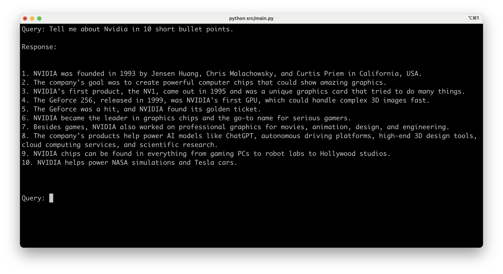

# chroma-llm-chatbot



## Getting Started

* Create virtual environment

```shell
python3.11 -m venv .venv
```

* Activate virtual environment

```shell
source ./.venv/bin/activate
```

* Bootstrap

```shell
sh bootstrap.sh
```

* Source .env

```shell
source .env
```

* Install dependencies

```shell
pip install -r requirements.txt
```

## `models` folder

Put models inside this folder.

Choose Lightweight LLM (CPU-Only). Use GGUF models with llama.cpp or 
Python bindings like llama-cpp-python.

Recommended Model:
- Phi-2 (2.7B) – very capable and CPU-friendly.
- TinyLlama (1.1B) – super lightweight.
- Mistral (7B)

## `documents` folder

Put your files inside this folder. It will be used to answer your queries.

## `example-docs` folder

This folder contains some sample files. You can copy them into
the `documents` folder to get started.

## Create/Update/Delete embeddings

After adding/updating/removing files in the `documents` folder, run the 
following command to create/update embeddings in the chroma vector database.

```shell
python3 src/embedding.py
```

You may want to delete the older database inside the `db` folder when making
changes to the chunk size, chuck overlap and adding/removing files from 
the `documents` folder.

## Query

Run the following command for question and answer assistance.

```shell
python3 src/main.py
```
